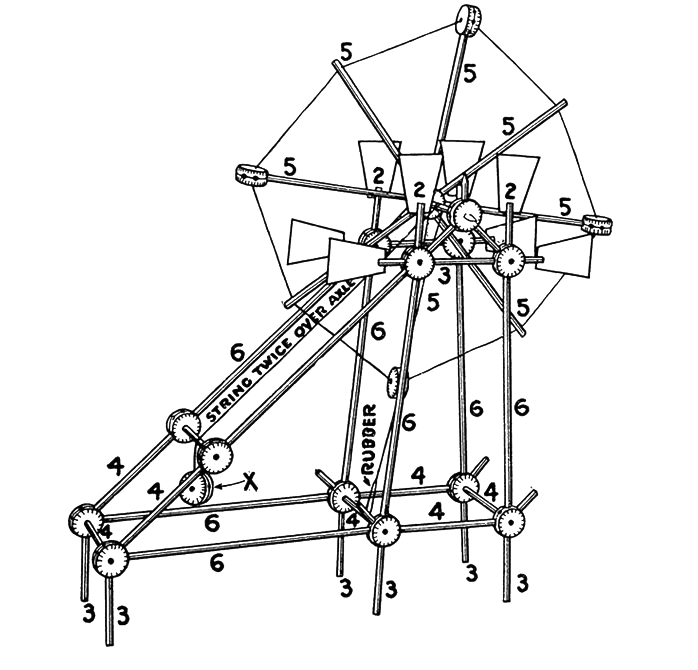
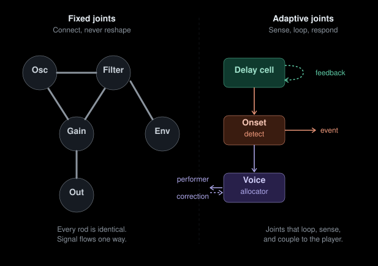

MetaSonic is a **compiler pipeline for real-time audio**, not a software
environment. It consists of a Haskell monadic DSL for describing synth
graphs, a C++20 runtime (`tinysynth`) that executes compiled graphs as dense
DSP kernels, and a deliberately minimal C ABI bridge between the two.

This post works through what Miller Puckette's
[keynote](https://youtu.be/ZLACjtOpe0Q) on software development,
composition, and music performance means for this project — both as
validation and as warning. Puckette is the creator of Max and Pure Data and
has been building real-time computer music tools since the 1980s. The talk
was delivered at CIRMMT/McGill.

The post separates three things that are easy to blur together: what Puckette
argues, what the current code actually does, and what we may want the project
to become.

<!--more-->

---

## Puckette's framework

These are the ideas from the talk that bear most directly on MetaSonic and
tinysynth.

**Science seeks universals; music seeks difference.** What makes a piece of
music interesting is how it differs from every other piece. Tools for making
music must not collapse that difference into uniformity.

**All environments are equivalent in output space.** CSound, SuperCollider,
Pd, a text editor with 44100 numbers per second — they can all produce any
sound a speaker can emit. What differs is accessibility: which subset of the
sound space does the tool make reachable with a finite amount of human
effort?

**The tool is never transparent.** Every set of primitives, every blank
canvas, every API surface channels the user toward a particular musical
worldview. The pursuit of transparency is valuable but impossible. The honest
response is to acknowledge our biases explicitly so others can consciously
deviate from them.

**Technology solidifies, then new layers pile on top.** The QWERTY keyboard,
MIDI, the mouse-window paradigm — these froze in place and never changed. New
opportunities exist at different levels (plugins, algorithms, compositional
paradigms), not in replacing what's solidified.

**The software is the filter.** A composer working for a month produces maybe
a megabit of input. The output space of a 10-minute piece is astronomically
larger. The software maps one to the other, discarding 99.9% of possibilities.
The tool builder is partly composing the music by deciding what is reachable.

**Fun is a legitimate design criterion.** If a tool isn't _fun_ to use, it
won't get adopted, because people learn by doing things they enjoy. No computer
scientist treats fun as a formal requirement, yet it's the _actual_ bottleneck.

**Instrumental control is a feedback loop, not a command stream.** A
violinist specifies pitch to three decimal places through a coupled dynamical
system — motor action, acoustic feedback, auditory correction. The information
flowing from player to instrument is insufficient on its own. Any computer
instrument that treats control as unidirectional (parameter → sound) is limited.

**Software dies like dinosaurs.** Commercial software grows features until it
collapses. A better alternative: stay small, modular, pluggable, written in
stable languages (not new languages).

**Nobody has made a "real" programming language.** Puckette's explicit dare.
SuperCollider is closest but hasn't achieved interchangeability of parts at
the level of C libraries. The test: "Is there a SuperCollider program that
does a quicksort, and can I get it as a library?"

---

## Where we stand?

Following MP's points, MetaSonic would be "stronger" when understood as an
attempt to answer Puckette's dare; it would be "weaker" when it drifts toward
being _yet another environment_.

The project should not try to be (or pretend to be) generically transparent and
attempt being explicit about its bias during development process: presently,
MetaSonic is for building small, typed, statically validated real-time audio
graphs. That is a musical stance, not an implementation "detail". Every
architectural decision is also a compositional decision about which kinds of
music the system considers natural.

The current architecture is structured as staged compilation:

```
Haskell DSL (Source)
    → Graph Validation (rate edges, dependencies)
    → Region Formation
    → Dense Lowering (symbolic → runtime indices)
    → FFI Marshaling (C ABI)
    → C++ Runtime (tinysynth)
    → Audio Output
```

The identity of the project is the *pipeline*, not the editor, not the host,
not the project format, not the transport, not the audio backend. Those are
_adapters_.

The staged architecture is already present and working: typed surface DSL,
validation, annotated IR, region formation, dense lowering, FFI marshaling, and
a runtime with both offline and realtime modes. The instincts for durability —
simple C ABI, dense wire format, descriptor-driven runtime — should not change,
since those instincts are fundamentally correct.

Right now, what the project lacks is not a "more clever design", but completion
in a few specific dimensions. The design changes below address those open
questions.

---

## Brief Discussion on Design Changes

### The stable thing is the contract, not the syntax

MetaSonic should stop behaving like "a nice strongly typed way to wire UGens"
and start behaving like "a compiler for portable musical processes." The stable
artifact is not the Haskell syntax and not the current runtime harness. The
stable thing is the contract: IR shape, node tags, port/control conventions, and
the C ABI.

The pipeline is already pointing that way — symbolic `NodeID`s lowered to
dense `NodeIndex` values, transferred across a deliberately small ABI. But
the Haskell/C++ tag map is already drifting.

Design change: freeze and version the contract before adding more nodes.
Add machine-checked compatibility tests between Haskell and C++.

### Feedback can no longer be an edge case

Puckette's point is deeper than "cycles are good," but at the code level we
still have to stop excluding them by construction. The current Haskell side
validates by topological sort and explicitly throws `Cycle detected`. The
runtime is built around feedforward execution over node order. Fine for
prototype. Not great for music instruments.

Design change: add explicit feedback semantics. A real `Delay` or `FeedbackCell`
node. A validation rule that permits cycles only when they contain a legal
break. Runtime semantics that say exactly what one-sample, one-block, or
interpolated feedback means.

Until that exists, we will be able to describe signal flow but not the class of
unstable, self-correcting, performer-coupled structures Puckette is pushing
toward.

### Temporal semantics must be explicit, not accidental

Several connected controls are block-latched using sample 0. That is not a minor
implementation detail. It is a design boundary.

Pitch, phase modulation, FM index, waveshaping amount, some feedback gains, and
probably a few control primitives need sample-accurate semantics. Other things
can remain block-rate or use interpolation.

Our rate system already exists on paper — `CompileRate`, `InitRate`,
`BlockRate`, `SampleRate` — but rates are still mostly inferred by node kind
rather than propagated from context. That's something we need to implement.

Design change (twofold): improve rate propagation in the compiler, and make the
runtime honor it with at least one end-to-end sample-accurate path. Otherwise
"rate" is not making its job in the best way: compiles nicely while dodging
musical consequence.

### The effect system needs to stop being theoretical

The `Eff` vocabulary already has `Pure`, `BusRead`, `BusWrite`, `BufRead`, and
`BufWrite`, and the notes explain why resource effects matter for scheduling. We
need to expand basic synthesis and Bus/Buf nodes in order to test them fully.

Design change: resource effects must become first-class compilation
facts, not comments. If we want Puckette's "reactive musical process" angle,
we need to decide whether `Reactive` or `Stateful` means anything
semantically beyond "this node has memory." In practice, that means adding
an event/control layer instead of forcing everything to cosplay as an audio
stream forever.

### The primitive set needs to change character

A runtime that offers sine, saw, gain, out, and biquads is a useful base, but
it is still a Tinkertoy set in software clothing.


*The canonical synthesis toolkit: round hubs in a few fixed sizes (oscillators,
filters, envelopes) joined by straight wooden dowels (audio and control wires).
You compose by choosing which hole to stick the rod into — never by reshaping
the pieces themselves.*

Tinkertoys are honest about their constraint: you build by *connecting*, and the
vocabulary of joints never grows. A saw into a filter into a gain into an output
is the same creative grammar whether the year is 1957 or 2026. You can assemble
elaborate structures, but each hub is inert — it does not change shape because
of what passes through it, it does not listen to its own output, it does not
respond to the performer's body.

Puckette explicitly asks what the interesting primitives are beyond oscillators
and filters. The question is not "how many modules?" but "what kind of joints?"
A Tinkertoy bridge and a bridge that senses wind load are both bridges. The
difference is that the second one has joints that *adapt* — connectors whose
geometry depends on the forces running through them. That is the kind of
primitive we are missing.


*Left: the Tinkertoy model — fixed hubs, rigid dowels, one-way signal flow.
Right: the three primitives that change the character of the system — a delay
cell that loops back on itself, an onset detector that senses what passes
through it and emits events, and a voice allocator that couples bidirectionally
to the performer.*

**Design change:** the next primitives should not just be "more filters." Add:

- a **delay/feedback cell** (enables recursive, self-listening structures — the
  joint that loops back on itself)
- one **analysis primitive** (envelope follower, onset detector — the joint that
  senses what passes through it)
- one **interaction primitive** (pitch tracker, gesture mapper, voice
  allocator — the joint that responds to the performer)

Those three alone shift the project from "typed signal chain compiler" toward
"system for building instruments and responsive musical agents." The q_lib
library already offers us such primitives. The key is not quantity. It is
choosing primitives that change what is musically *easy to discover*.

There is a second lesson in the Tinkertoy image worth keeping: they are *fun*.
Puckette names fun as a legitimate design criterion, and Tinkertoys succeed on
exactly that axis — immediate tactile feedback, visible structure, no manual
required. The danger for MetaSonic is that the Haskell DSL turns the building
process into something that feels more like filling out tax forms than snapping
colorful sticks together. The "immediacy" priority elsewhere in this post is
partly about recovering the Tinkertoy *feel* while escaping the Tinkertoy
*limitation*.

### Make immediacy a requirement

If the first experience is still "write Haskell, compile, marshal, load graph,
start runtime, maybe process a few blocks," then the project is optimized for
developers, not the musician's hands.

Design change: make one short path to audible results feel immediate. A tiny
audition REPL, a canned MIDI-playable template, instant graph reload, or a
dead-simple `.play`-style entry point. The goal is to "make one path to sound
feel fast."

### Define the bias and signature affordances explicitly

The Haskell DSL is already biased toward explicit graph construction,
explicit dependencies, and topological order. That is not a flaw. It is a
stance.

Design change: pick two or three affordances and optimize hard for them
instead of vaguely aspiring to generality. Candidates:

- typed, statically validated real-time graphs
- portable compiled runtime graphs over a tiny ABI
- safe reloadable execution units

Once those are named, every addition can be judged by whether it strengthens
them or just inflates an unmaintainable "monster". Without such discipline,
the project will slowly rebuild a little environment.

### External target

MetaSonic is not yet a solved answer to Puckette's "missing programming
language." It is an attempt. Presently, `tinysynth` is not yet obviously
hostable everywhere. It has a small C ABI and a dense graph transfer protocol.
It's not there, but it points in the right direction.

Design change: prove one external host target. A Pd external, a CLAP/VST shell,
or one standalone embedding target. Because until a compiled graph runs outside
our own harness, "interchangeability" is still aspiration. Building that one
bridge will force the right abstractions faster than more elegant internal
modules.

---

## Priority list

**Contract integrity.**
Freeze the ABI, node tags, IR shape, and port/control conventions. Add
machine-checked compatibility tests.

**Temporal and feedback semantics.**
Implement one legal feedback mechanism, one sample-accurate modulation path,
and rate propagation in the compiler.

**Musical vocabulary.**
Add a delay/feedback primitive, one analysis primitive, and one performance
primitive such as voice allocation or event/control objects.

**Immediacy.**
Provide one path where a user hears sound almost immediately, for example, using
Haskell REPL examples.

**External proof.**
Make one host target work so `metasonic` is visibly a pipeline and
`tinysynth` is visibly a reusable substrate.

---

## Open Questions

These are the questions not answered by design changes above:

### Language & compiler

- How should regions relate to scheduling? Should region formation be
  informed by temporal constraints (e.g., "this subgraph only runs when
  triggered")?
- Can the DSL express temporal structure, or is the absence of time a
  deliberate stance?

### Runtime

- Is tinysynth only a runtime behind the Haskell compiler, or should it be
  embeddable independently?

### Human interface

- What are the signature musical affordances that should become the
  project's "identity"?

### Persistence & modularity

- What is the serialization format for compiled graphs? Are we good already?

---

## What this project is not

- **Not an environment.** No editor, no project format, no transport. Those
  are _adapter_ layers.
- **Not a finished language.** It is a promising compiler skeleton. The
  reactive, general-purpose music language Puckette describes as missing does
  not exist. Although, we have both Haskell and C++ (stable languages) systems
  available for both the DSL and runtime.
- **Not neutral.** It has biases. They should be documented honestly.